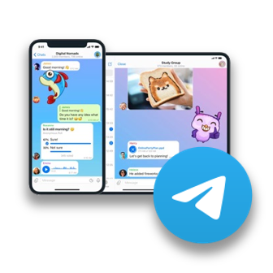

# Go-based library for developing Telegram client applications 

*Developed in 2020* *(Updated for latest version of TDLib)* 
<br>


In this project, a **[Go](https://go.dev/)-based library** was developed to make programmers more productive in developing Telegram client applications. 
In this project, we used the powerful [TDLib (Telegram Database Library)](https://github.com/tdlib/td) library, which is [developed and provided by Telegram](https://core.telegram.org/tdlib) in **C/C++** language. 
Details of the various sections and related methods are provided below. 
<br> 


<br><br>
<picture></picture> 
<br>


### Installation:
```bash 
go get github.com/iamkaro/Go-based-library-for-Telegram-Client@latest
```


### Getting started
This section describes how to use and get started with this library. 
We have provided how to authentication and login user, which is presented in the following code snippet: 
```go
package main

import ( 
  "fmt"
  "time"

  "github.com/iamkaro/Go-based-library-for-Telegram-Client/telegram" 
)

const (
  apiID   uint64 = 123456789 //your api ID
  apiHash string = "abc..."  //your api hash
)

func main() {
  var ( 
    client = telegram.NewClient(apiID, apiHash, "tg-data") 
    read   = func(name string) (value string) { fmt.Print(name); _, _ = fmt.Scanln(&value); return }
  )
  if client == nil {
    fmt.Println("client starting error !!!")
    return
  }
  for {
    if state := client.Auth.State(); state != nil {
      switch {
      case state.EnterPhone:
        client.Auth.EnterPhone(read("Phone: "))
        continue
      case state.EnterCode:
        client.Auth.EnterCode(read("Code: "))
        continue
      case state.EnterPassword != nil:
        client.Auth.EnterPassword(read("Password[hint:" + state.EnterPassword.Hint + "]: "))
        continue
      case state.RegistrationUser:
        client.Auth.RegistrationUser(read("Name: "), read("LastName: "))
        continue
      case state.OK:
        fmt.Println("Auth ok ...")

        
        // use your methods ...


        return
      }
      fmt.Println("status error !!! ", state)
      time.Sleep(1 * time.Second)
      continue
    }
    fmt.Println("state is null !!!")
    time.Sleep(1 * time.Second)
  }
}

```


## Documentation 
In this section, details of the various sections of the library and the available methods are provided along with relevant explanations.


### Basic methods of `client` object
This section presents the basic methods related to the `client` object itself. 

##### Methods: 
- `client.On()` <br> 
  <sup>This method turns the data receiver back on if it is turned off.</sup>    
- `client.Off()` <br>
  <sup>This method turns off the data receiver.</sup> 
- `client.Destroy()` <br>
  <sup>This method deletes the `client` object and clears the RAM.</sup>  
- `client.PrintAllReceivingData(enable)` <br>
  <sup>This method enables and disables the data printer. If you set the `enable` value to `true`, it will print all the data received from the server to the terminal output.</sup>  
- `client.Load(&output, params)` <br>
  Using this method, you can send raw requests in JSON format directly to the Telegram server and receive the corresponding response in JSON form from the Telegram server. 
  **We have implemented most of the commonly used Telegram API methods, but if you need a specific method, you can handle the corresponding request this way.** 


### Proxies 
This section of the library provides the methods necessary to manage proxies. 
To access the relevant methods, simply call the `client.Proxies` subclass of the `client` object. 

##### Methods: 
- `client.Proxies.AddHttp(server, port, user, pass, httpOnly, enable)` 
- `client.Proxies.AddSocks5(server, port, user, pass, enable)` 
- `client.Proxies.AddMTProto(server, port, secret, enable)` 
- `client.Proxies.GetAll()` 
- `client.Proxies.Remove(proxyID)` 
- `client.Proxies.Enable(proxyID)` 
- `client.Proxies.Disable()` 


### Auth  
This section of the library provides the necessary methods for user authentication and login. 
To access the relevant methods, simply call the `client.Auth` subclass of the `client` object. 

##### Methods: 
- `client.Auth.State()` 
- `client.Auth.EnterPhone(phone)` 
- `client.Auth.EnterCode(code)` 
- `client.Auth.EnterPassword(password)` 
- `client.Auth.RegistrationUser(name, lastname)` 


### Self 
This section of the library provides the methods necessary to work with the currently logged in user. 
To access the relevant methods, simply call the `client.Self` subclass of the `client` object. 

##### Methods: 
- `client.Self.GetMe()` 
- `client.Self.SetName(name, lastname)` 
- `client.Self.SetUsername(username)` 
- `client.Self.SetBio(bio)` 
- `client.Self.SetProfilePhoto(path)` 
- `client.Self.DeleteProfilePhoto(id)` 
- `client.Self.LogOut()` 


### Sessions  
This section of the library provides the methods necessary to manage user sessions on various systems. 
To access the relevant methods, simply call the `client.Sessions` subclass of the `client` object. 

##### Methods: 
- `client.Sessions.GetAll()` 
- `client.Sessions.Terminate(id)` 
- `client.Sessions.TerminateAllOther()` 


### Users  
This section of the library provides the methods necessary to work with users. 
To access the relevant methods, simply call the `client.Users` subclass of the `client` object. 

##### Methods: 
- `client.Users.Get(userID)` 
- `client.Users.GetFullInfo(userID)` 
- `client.Users.GetProfilePhotos(userID, offset, limit)` 


### Chats 
This section of the library provides the methods necessary to work with chats. 
To access the relevant methods, simply call the `client.Chats` subclass of the `client` object. 

##### Loading chats: 
- `client.Chats.Get(chatID)` 
- `client.Chats.GetByUsername(username)` 
- `client.Chats.GetList.AllOfMainList(limit)` 
- `client.Chats.GetList.AllOfArchiveList(limit)` 
- `client.Chats.GetList.Users(limit)` 
- `client.Chats.GetList.Groups(limit)` 
- `client.Chats.GetList.Channels(limit)` 
- `client.Chats.GetList.Bots(limit)` 
- `client.Chats.GetList.InlineBots(limit)` 
- `client.Chats.GetList.Calls(limit)` 
- `client.Chats.GetList.ForwardChats(limit)` 

##### Joining chats: 
- `client.Chats.Join.ByChatId(chatID)` 
- `client.Chats.Join.ByInviteLink(link)` 
- `client.Chats.InviteLink.Check(link)` 

##### Working with chats and their features: 
- `client.Chats.Open(chatID)` 
- `client.Chats.Close(chatID)` 
- `client.Chats.Leave(chatID)` 
- `client.Chats.Notification(chatID, disable)` 
- `client.Chats.TransferOwner(chatID, toUserID, password)` 
- `client.Chats.GetAdministrators(chatID)` 
- `client.Chats.UpgradeToSuperGroup(basicGroupID)` 
- `client.Chats.SetState(chatID, isUnread)` 
- `client.Chats.SetUsername(chatID, username)` 
- `client.Chats.SetDescription(chatID, description)` 
- `client.Chats.SetLocation(chatID, latitude, longitude, address)` 
- `client.Chats.SetTitle(chatID, title)` 
- `client.Chats.SetPhoto(chatID, path)` 
- `client.Chats.SetPermissions(chatID, canSendMessages, canSendMediaMessages, canSendPolls, canSendOtherMessages, canAddWebPagePreviews, canChangeInfo, canInviteUsers, canPinMessages)` 
- `client.Chats.SetChatLists.Main(chatID)` 
- `client.Chats.SetChatLists.Archive(chatID)` 

##### Load chat members: 
- `client.Chats.Members.Get(chatID, userID)` 
- `client.Chats.Members.GetAdministrators(chatID, offset, linit)` 
- `client.Chats.Members.GetRecentlyActive(chatID, offset, linit)` 
- `client.Chats.Members.GetBots(chatID, offset, linit)` 
- `client.Chats.Members.GetBanned(chatID, offset, linit, query)` 
- `client.Chats.Members.GetContacts(chatID, offset, linit, query)` 
- `client.Chats.Members.GetRestricted(chatID, offset, linit, query)` 
- `client.Chats.Members.GetSearch(chatID, offset, linit, query)` 

##### Add and manage chat members:  
- `client.Chats.Members.Add(chatID, userID, forwardlimit)` 
- `client.Chats.Members.AddList(chatID, arrayOFUserID)` 
- `client.Chats.Members.SetStatus.Member(chatID, userID)` 
- `client.Chats.Members.SetStatus.Banned(chatID, userID, until)` 
- `client.Chats.Members.SetStatus.Left(chatID, userID)` 
- `client.Chats.Members.SetStatus.Restricted(chatID, userID, until, canSendMessages, canSendMediaMessages, canSendPolls, canSendOtherMessages, canAddWebPagePreviews, canChangeInfo, canInviteUsers, canPinMessages)` 
- `client.Chats.Members.SetStatus.Administrator(chatID, userID, title, canBeEdited, canChangeInfo, canPostMessages, canEditMessages, canDeleteMessages, canInviteUsers, canRestrictMembers, canPinMessages, canPromoteMembers)` 
- `client.Chats.Members.SetStatus.Creator(chatID, userID, title)` 


### Messages 
This section of the library provides the methods necessary to work with messages. 
To access the relevant methods, simply call the `client.Messages` subclass of the `client` object. 

##### Loading messages: 
- `client.Messages.Get(chatID, messageID)` 
- `client.Messages.GetReplied(chatID, replayMessageID)` 
- `client.Messages.GetPublicLink(publicChatID, messageID, forAlbum)` 
- `client.Messages.GetLocally(chatID, messageID)` 
- `client.Messages.GetLastBeforeDate(chatID, date)` 
- `client.Messages.GetList(chatID, arrayOfMessageID)` 
- `client.Messages.GetChatHistory(chatID, fromMessageID, offset, limit, onlyLocal)` 

##### Working with message features: 
- `client.Messages.View(chatID, arrayOfMessageID, forceRead)` 
- `client.Messages.OpenContent(chatID, messageID)` 
- `client.Messages.ReadAll(chatID)` 
- `client.Messages.SetDraft(chatID, replayTO, text, disableWebPreview, clearDraft)` 

##### Counting messages: 
- `client.Messages.Count.Mentions(chatId, returnLocal)` 
- `client.Messages.Count.UnreadMentions(chatId, returnLocal)` 
- `client.Messages.Count.Calls(chatId, returnLocal)` 
- `client.Messages.Count.Audios(chatId, returnLocal)` 
- `client.Messages.Count.Animations(chatId, returnLocal)` 
- `client.Messages.Count.ChatPhotos(chatId, returnLocal)` 
- `client.Messages.Count.Documents(chatId, returnLocal)` 
- `client.Messages.Count.MissedCalls(chatId, returnLocal)` 
- `client.Messages.Count.PhotoAndVideos(chatId, returnLocal)` 
- `client.Messages.Count.Photos(chatId, returnLocal)` 
- `client.Messages.Count.Urls(chatId, returnLocal)` 
- `client.Messages.Count.Videos(chatId, returnLocal)` 
- `client.Messages.Count.VoiceNotes(chatId, returnLocal)` 
- `client.Messages.Count.VoiceAndVideoNotes(chatId, returnLocal)` 

##### Search messages: 
- `client.Messages.Search.Full(chatId, query, senderUserId, fromMessageId, offset, limit)` 
- `client.Messages.Search.Mentions(chatId, query, senderUserId, fromMessageId, offset, limit)` 
- `client.Messages.Search.UnreadMentions(chatId, query, senderUserId, fromMessageId, offset, limit)` 
- `client.Messages.Search.Photos(chatId, query, senderUserId, fromMessageId, offset, limit)` 
- `client.Messages.Search.Documents(chatId, query, senderUserId, fromMessageId, offset, limit)` 
- `client.Messages.Search.Videos(chatId, query, senderUserId, fromMessageId, offset, limit)` 
- `client.Messages.Search.Audios(chatId, query, senderUserId, fromMessageId, offset, limit)` 
- `client.Messages.Search.VoiceNotes(chatId, query, senderUserId, fromMessageId, offset, limit)` 
- `client.Messages.Search.ChatPhotos(chatId, query, senderUserId, fromMessageId, offset, limit)` 
- `client.Messages.Search.Animations(chatId, query, senderUserId, fromMessageId, offset, limit)` 
- `client.Messages.Search.Calls(chatId, query, senderUserId, fromMessageId, offset, limit)` 
- `client.Messages.Search.MissedCalls(chatId, query, senderUserId, fromMessageId, offset, limit)` 
- `client.Messages.Search.Urls(chatId, query, senderUserId, fromMessageId, offset, limit)` 
- `client.Messages.Search.VideoNotes(chatId, query, senderUserId, fromMessageId, offset, limit)` 
- `client.Messages.Search.PhotoAndVideos(chatId, query, senderUserId, fromMessageId, offset, limit)` 
- `client.Messages.Search.VoiceAndVideoNotes(chatId, query, senderUserId, fromMessageId, offset, limit)` 

##### Send message: 
- `client.Messages.Send.Text(chatID, replayMsgID, disableNotification, text, disableWebPagePreview, clearDraft)` 
- `client.Messages.Send.Contact(chatID, replayMsgID, disableNotification, phone, name, lastname)` 
- `client.Messages.Send.Location(chatID, replayMsgID, disableNotification, latitude, longitude)` 
- `client.Messages.Send.Photo(chatID, replayMsgID, disableNotification, path, width, height, caption)` 
- `client.Messages.Send.Audio(chatID, replayMsgID, disableNotification, path, duration, title, caption)` 
- `client.Messages.Send.Document(chatID, replayMsgID, disableNotification, path, caption)` 
- `client.Messages.Send.Video(chatID, replayMsgID, disableNotification, path, duration, width, height, streaming, caption)` 
- `client.Messages.Send.VideoNote(chatID, replayMsgID, disableNotification, path, duration, length)` 
- `client.Messages.Send.VoiceNote(chatID, replayMsgID, disableNotification, path, duration, caption)` 
- `client.Messages.Send.BotStart(botUserId, chatID, parameter)` 
- `client.Messages.Send.Forwarded(chatID, replayMsgID, disableNotification, fromChatID, messageID, inGameShare, sendCopy, removeCaption)` 
- `client.Messages.Send.PollRegular(chatID, replayMsgID, disableNotification, question, options, isAnonymous, multipleAnswers, isClosed)` 
- `client.Messages.Send.ScreenshotTaken(chatID)` 

##### Send chat-actions: 
- `client.Messages.Send.ChatAction.Typing(chatID)` 
- `client.Messages.Send.ChatAction.ChoosingLocation(chatID)` 
- `client.Messages.Send.ChatAction.ChoosingContact(chatID)` 
- `client.Messages.Send.ChatAction.RecordingVideo(chatID)` 
- `client.Messages.Send.ChatAction.RecordingVideoNote(chatID)` 
- `client.Messages.Send.ChatAction.RecordingVoiceNote(chatID)` 
- `client.Messages.Send.ChatAction.StartPlayingGame(chatID)` 
- `client.Messages.Send.ChatAction.UploadingDocument(chatID)` 
- `client.Messages.Send.ChatAction.UploadingPhoto(chatID)` 
- `client.Messages.Send.ChatAction.UploadingVideo(chatID)` 
- `client.Messages.Send.ChatAction.UploadingVideoNote(chatID)` 
- `client.Messages.Send.ChatAction.UploadingVoiceNote(chatID)` 
- `client.Messages.Send.ChatAction.Cancel(chatID)` 

##### Edit message: 
- `client.Messages.Edit.Text(chatID, messageID, text, disableWebPagePreview, clearDraft)` 
- `client.Messages.Edit.Caption(chatID, messageID, caption)` 
- `client.Messages.Edit.Photo(chatID, messageID, path, width, height, caption)` 
- `client.Messages.Edit.Video(chatID, messageID, path, duration, width, height, supportsStreaming, caption)` 
- `client.Messages.Edit.Audio(chatID, messageID, path, duration, title, caption)` 
- `client.Messages.Edit.Document(chatID, messageID, path, caption)` 

##### Pin message: 
- `client.Messages.Pin.Get(chatID)` 
- `client.Messages.Pin.Set(chatID, messageID, disableNotification)` 
- `client.Messages.Pin.Remove(chatID)` 

##### Delete messages: 
- `client.Messages.Delete.List(chatID, arrayOfMessageID, forAll)` 
- `client.Messages.Delete.ChatHistory(chatID, forAll, removeChat)` 
- `client.Messages.Delete.AllFromUser(chatID, userID)` 


### Callback   
This section of the library provides the necessary methods to send callbacks to Telegram bots and games. 
To access the relevant methods, simply call the `client.Callback` subclass of the `client` object. 

##### Methods: 
- `client.Callback.Data(chatID, messageID, data)` 
- `client.Callback.Game(chatID, messageID, gameSortName)` 
- `client.Callback.DataWithPassword(chatID, messageID, password, data)` 


### Contacts   
This section of the library provides the methods necessary to work with contacts. 
To access the relevant methods, simply call the `client.Contacts` subclass of the `client` object. 

##### Methods: 
- `client.Contacts.Add(phone, name, lastname)` 
- `client.Contacts.Remove(usersID)` 
- `client.Contacts.Import(contacts)` 
- `client.Contacts.ImportedGetCount()` 
- `client.Contacts.ImportedClearAll()` 
- `client.Contacts.GetAll()` 


### Files   
This section of the library provides the methods necessary to work with files. 
To access the relevant methods, simply call the `client.Files` subclass of the `client` object. 

##### Methods: 
- `client.Files.GetFile(fileID)` 
- `client.Files.GetFileMimeType(path)` 


